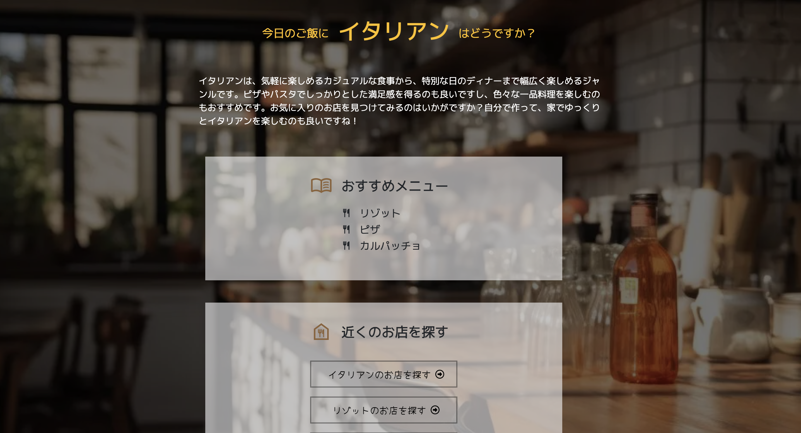

# RANDOM DISH

## 概要
RANDOM DISHは、何を食べようか迷った時、食事メニューを提案してくれるWebサイトです。  
食べたい料理のジャンルを選択するだけで、そのジャンルに基づいた3つのランダムな料理を提案します。  
また、提案された料理を提供する近くのレストランを検索することもできます。
  

## 特徴
- **ジャンル選択**: 和食、中華、韓国料理、イタリアン、洋食の5つのジャンルから選択できます。
- **ランダム料理提案**: 選択したジャンルに基づいて、3つのランダムな料理を提案します。
- **レストラン検索**: 提案された料理を提供する近くのレストランを現在地から検索できます。
- **再試行オプション**: 提案された料理に満足できない場合は、再試行して新しい提案を受けることが可能です。

## 使用方法
1. `button.html`をウェブブラウザで開きます。
2. 興味のある料理ジャンルのチェックボックスを選択します。
3. 「START!」ボタンをクリックすると、ランダムに選ばれた3つの料理が提案されます。
4. 提案された料理は`index.html`に表示され、ボタンを押すと近くのレストランを検索することができます。画面下の「RETRY」ボタンを押すと、再度料理を選び直すことができます。

## 技術スタック
- **HTML/CSS**: ウェブページの構造とスタイリングに使用。
- **JavaScript**: ランダムな料理選択ロジックとページ間のインタラクションを処理。
- **Bootstrap**: レスポンシブなレイアウトとデザインに使用。
- **Google Fonts & FontAwesome**: フォントとアイコンに使用。
- **Geolocation API**: ユーザーの現在地に基づいて近くのレストランを検索する機能。

## 今後の改善点
- **レシピ提案**: 提案された料理のレシピを提供。
- **ジャンルの拡充**: さらに多くの料理ジャンルと料理オプションを追加。
- **ユーザー設定**: ユーザーが好みのジャンルや料理を保存し、カスタマイズできる機能。

